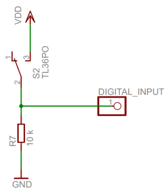
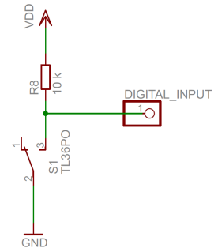

# GPIO and PWM

**Input** **and** **output**

The IO-pins on our development board are bidirectional and individually
configurable. Pico SDK includes functions for setting pin direction and
for reading or writing the pin state.

Study
[<u>https://www.raspberrypi.com/documentation/pico-sdk/hardware.html#hardware_gpio.</u>](https://www.raspberrypi.com/documentation/pico-sdk/hardware.html#hardware_gpio)
Pay attention to configuring pin direction and pull-ups, and how to read
the state of each pin.

Study
[<u>https://www.raspberrypi.com/documentation/pico-sdk/hardware.html#hardware_pwm</u>](https://www.raspberrypi.com/documentation/pico-sdk/hardware.html#hardware_pwm)

When simple (single pole) push button is connected to an input, a pull
up or pull-down resistor is required to ensure that a pin always has a
stable value. Pull up/pull down resistor will force the pin into a
default state if the pin is left floating (unconnected).

A pin with a button and a pull up resistor has default value of one.
When the button is pressed the pin goes low and reads zero.

A pin with a button and a pull-down resistor has default value of zero.
When the button is pressed the pin goes high and reads one.

>  **Picture 1** **Pull** **up** **resistor**
>  **Picture 2** **Pull** **down** **resistor**

Our board has three buttons that are wired to GPIO pins 7, 8, and 9. The
buttons are grounding buttons and need a pull up resistors for reading
their state.

There are also three LEDs that are wired to GPIO pins 20, 21, and 22.

**Exercise** **1** **-** **Dimmer**

Follow instructions in clion_setup.pdf to create CMake project.

Implement a program for switching all three LEDs on/off and dimming
them. The program should work as follows:

> • SW1, the middle button is the on/off button. When button is pressed
> the state of LEDs is toggled. Program must require the button to be
> released before the LEDs toggle again. Holding the button may not
> cause LEDs to toggle multiple times.
>
> • SW0 and SW2 are used to control dimming when LEDs are in ON state.
> SW0 increases brightness and SW2 decreases brightness. Holding a
> button makes the brightness to increase/decrease smoothly. If LEDs are
> in OFF state the buttons have no effect.
>
> • When LED state is toggled to ON the program must use same brightness
> of the LEDs they were at when they were switched off.
>
> • If LEDs are ON and dimmed to 0% then pressing SW1 will set 50%
> brightness immediately. • If LEDs are ON and dimmed to 0% then
> pressing SW0 will increase the brightness.
>
> • PWM frequency divider must be configured to output 1 MHz frequency
> and PWM frequency must be 1 kHz.